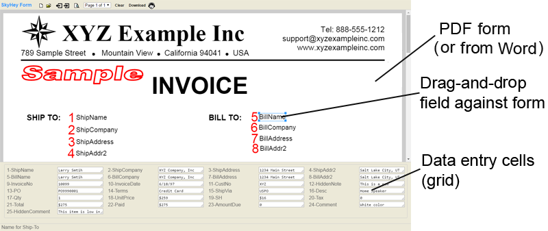

<h2>API Library for SkyHey PDF Form Filler</h2>
 
The API library allows you to programatically fill out your PDF forms.
  
Before using the API, you first make your PDF form fillable with SkyHey PDF Form Filler online at  
 
<a target="_blank" href="https://skyhey.com/app">https://skyhey.com/app</a>

  
SkyHey PDF Form Filler also allows you to manually fill out your PDF forms.
It is the fastest way to fill out your business forms.

  
<h3>SkyHey PDF Form Filler</h3>

  
You make your PDF form fillable by opening your PDF form with SkyHey and adding fields onto the form. 
A data entry grid is automatically generated for the fastest data entry.

  
Features
 

<ul>
<li>Fastest data entry: tab-and-type in the entry grid -- No need to use mouse</li>
<li>Fast preview: instant preview for the filled-out form</li>
<li>Download filled-out form as PDF</li>
<li>Email filled-out form as PDF</li>
<li>Save form data to Excel sheet</li>
<li>Search and retrieve form data for report generation and data export</li>
<li>Support shortcut keys</li>
<li>Support signature</li>
<li>and much more...</li>
</ul>	   

 
<h3>Your Word Document as Fillable Form</h3>

You may convert your Word document to PDF and then fill out the form. 
You may convert as follows: 
Open your document with Word and save it as PDF format 
or Upload your document to Google Drive and download it as PDF format

 
<h3>API Library for SkyHey PDF Form Filler</h3>

<h4>Required Info for API</h4>

<pre>
After you make your form fillable with SkyHey PDF Form Filler, click the API button on the toolbar.
You will get the following info for API call.  

Form ID:  form ID;
ApiKey: API key;
Form JSON Template: JSON template to be populated with your own form data for filling out the form.
</pre>

 
<h4>Method</h4>

skyheyForm.generateFilledPdf(options, callback);

<pre>
where
var options = { url: url, formId: formId, formName: formName, formData: formData };

url: URL for your server page that forwards call to SkyHey API service. You specify API_KEY (see ApiKey above) in the server page;
formId: form ID for the form to be filled out by the API call (see Form ID above);
formName: download file name for the generated PDF file;
formData: JSON data for filling out the form (see Form JSON Template above).

var callback = function (result) {};

result.success: call is successful if true; or call failed if false;
result.url: url for downloading the generated PDF;
result.formName: file name for the PDF file download.
</pre>

 
<h4>Example</h4>

<pre><code>                  
        //C#
        //var url = "./server/csharp/client_call_forward.aspx";
        //php
        var url = "./server/php/client_call_forward.php";

        var formId = "2";
        var formName = "my_form.pdf";
        var formData = {"name": "Joe Smith", "email": "joe.smith@example.com", "address": "123 Main Street, San Jose, CA 94045"};
        var options = { url: url, formId: formId, formName: formName, formData: formData };

        //generate filled pdf
        skyheyForm.generateFilledPdf(options, function (result) {
            //ok
            if (result.success) {
                //set download link
                var e = document.getElementById("formDownload");
                e.setAttribute("href", result.url);
                e.setAttribute("download", result.formName);
            }
            //error
            else {
                alert("error");
            }
        });

</code></pre>
 
	See the index.html for a complete example.

  
<h4>Summary of Steps for API Usage</h4>

<pre>
-Make your PDF form fillable by adding to-be-filled fields to the forms with SkyHey Form Filler online at 
 https://skyhey.com/app

-Get the required info by clicking the API button on the toolbar of SkyHey Form Filler

-Set your API_KEY in the server page

-Call skyheyForm.generateFilledPdf to generate the filled-out PDF
</pre>

 
<h4>License</h4>
The license is for the API library under MIT licensing.

